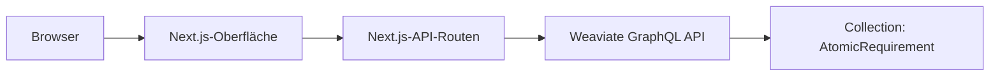

# Agrardatenkatalog BW – eigenständiger App-Nachbau

Diese Next.js-Anwendung bildet die zentralen Such- und Recherchefunktionen des im Projekt erprobten Base44-Demonstrators nach. Sie greift serverseitig auf die Weaviate-Collection `AtomicRequirement` zu und stellt keine produktive oder rechtsverbindliche Fachanwendung dar.

## Funktionen

- Volltextsuche in atomaren, quellengebundenen Anforderungen
- Filterung nach ausgewählten Quellendokumenten
- strukturierte Trefferliste mit Quelle, Fundstelle und Anforderungstext
- Detailansicht mit Akteur, Handlung, Objekt, Bedingung, Frist, Nachweis und Originalzitat
- Übersicht der im Suchraum enthaltenen Quellendokumente
- ausschließlich serverseitige Nutzung des Weaviate-Schlüssels

## Architektur



## Lokale Einrichtung

Voraussetzung ist Node.js 20.9 oder neuer.

```bash
npm install
```

Anschließend `.env.example` als `.env.local` kopieren und die lokalen Werte eintragen:

```env
WEAVIATE_URL="https://dein-cluster.weaviate.cloud"
WEAVIATE_API_KEY="dein-weaviate-api-key"
WEAVIATE_COLLECTION="AtomicRequirement"
SEARCH_LIMIT_DEFAULT="30"
```

Die Entwicklungsumgebung startet mit:

```bash
npm run dev
```

Standardadresse: `http://localhost:3000`

## Prüfung und Build

```bash
npm run lint
npm run build
```

Die App kann anschließend mit `npm start` ausgeführt werden.

## Deployment

Die Anwendung kann auf einer Node.js-kompatiblen Plattform, beispielsweise Vercel, bereitgestellt werden. Dort müssen dieselben Umgebungsvariablen gesetzt werden. Zugangsdaten gehören niemals in Repository, Browser-Code oder Build-Artefakte.

## Datenabhängigkeit und Grenzen

Die Live-Suche setzt einen erreichbaren Weaviate-Cluster mit dem in der Pipeline erzeugten Schema voraus. Falls dieser Dienst nicht mehr verfügbar ist, bleiben Code und Dokumentation reproduzierbar; die dynamische Suche funktioniert dann jedoch nicht. Für einen dauerhaften Betrieb wären Hosting, Datenpflege, Authentifizierung, Berechtigungskonzept, Monitoring und fachliche Freigabe gesondert zu organisieren.

## Verhältnis zum Base44-Demonstrator

Der ursprüngliche Demonstrator wurde in Base44 erstellt. Dieser Ordner enthält keinen automatischen Export der proprietären Base44-Anwendung, sondern einen eigenständigen, quelloffen nachvollziehbaren Nachbau ihrer zentralen Funktionen.
