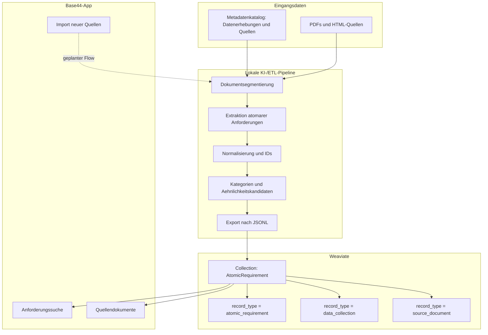
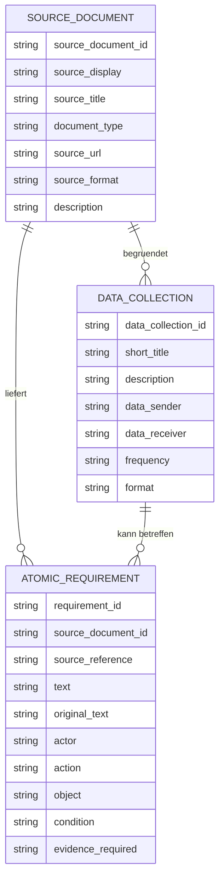
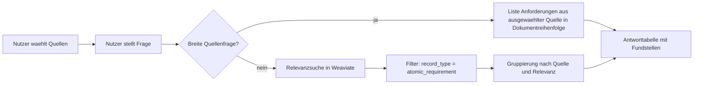

# Architekturuebersicht

## Kurzbeschreibung

Der Prototyp besteht aus drei Ebenen:

1. Lokale Verarbeitung von Dokumenten und Metadaten
2. Suchindex in Weaviate
3. Nutzeroberflaeche in Base44

Die App selbst beantwortet Fragen nicht aus frei erfundenem Wissen, sondern sucht in einem Katalog aus quellengebundenen Objekten. Dadurch bleiben Quelle, Fundstelle und Originalkontext sichtbar.

## Komponenten

## Datenmodell im Suchindex

## Suchlogik in der App

## Warum Weaviate?

Weaviate dient als zentraler Suchraum fuer heterogene Objekte. Aktuell wird BM25/Textsuche genutzt. Spaeter kann ein echter Vektorindex mit Embeddings ergaenzt werden, um semantische Aehnlichkeit robuster abzubilden.

## Warum Base44?

Base44 liefert eine schnelle Weboberflaeche fuer den Prototyp:

- keine lokale Installation fuer Testnutzer
- schnelle Anpassung der UI
- einfache Demonstration im Abschlussbericht
- gute Trennung zwischen Datenkatalog, Anforderungssuche und Importseite

## Grenzen des Prototyps

- Bioland und ECOVIN wurden regelbasiert importiert und muessen fachlich geprueft werden.
- Nicht alle Dokumente sind vollstaendig extrahiert.
- Der PDF-Import in der App ist als Zielbild vorbereitet, aber noch nicht als vollautomatischer Produktionsdienst umgesetzt.
- Echte API-Keys und urheberrechtlich geschuetzte PDFs gehoeren nicht in das GitLab.
