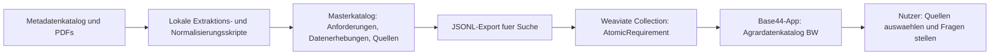

# DaVe Abschlussbericht - Digitale Ergaenzung und Agrardatenkatalog BW

Dieses Repository ergaenzt den statischen Abschlussbericht des Projekts **DaVe** um digitale Artefakte, interaktive Ansichten und einen KI-Prototypen.

Der statische Bericht kann grosse, verschachtelte Diagramme, Rohartefakte und interaktive Suchfunktionen nur begrenzt abbilden. Dieses Repository macht diese Inhalte nachvollziehbar, wiederverwendbar und technisch anschlussfaehig.

GitLab-Projekt:

<https://aidaho-edu.uni-hohenheim.de/gitlab/410b/dave-abschlussbericht>

## Inhalte

Das Repository buendelt drei Arten von Ergebnissen:

1. **AP 2: Kostenanalyse**
   - Detailansichten und Tabellen der Kostenanalyse
   - ergaenzende Dateien fuer die Weiterverarbeitung

2. **AP 3: Datenflussanalyse**
   - verschachtelte Datenfluss- und BPMN-Diagramme
   - Rohartefakte fuer die weitere Modellierung

3. **KI-Prototyp: Agrardatenkatalog BW**
   - Extraktion atomarer Anforderungen aus Gesetzen, Standards und Richtlinien
   - Aufbau eines durchsuchbaren Anforderungskatalogs
   - Anbindung an Weaviate als Suchspeicher
   - Bedienoberflaeche in Base44

## Agrardatenkatalog BW

Der Prototyp erschliesst Agrarstandards, Fachrecht, Foerderrichtlinien und weitere Grundlagendokumente. Fliesstext-Dokumente werden in atomare Anforderungen zerlegt und mit Quelle, Fundstelle und Originaltext verbunden.

Ziel ist, dass Nutzer Fragen stellen koennen, zum Beispiel:

> Was muss ich im Bioland-Hopfenanbau zum Abstand zu konventionellen Hopfengaerten beachten?

Die App durchsucht dann den Katalog und zeigt passende atomare Anforderungen mit Quelle, Fundstelle und weiteren Detailinformationen an.

## Aktueller Stand des KI-Prototyps

- Atomare Anforderungen: 878
- Datenerhebungen: 70
- Quellendokumente: 46
- Weaviate-Objekte insgesamt: 994
- Weaviate-Collection: `AtomicRequirement`

Enthaltene groessere Standards im aktuellen Prototyp:

- `Bioland (Bioland-Richtlinien)`: 554 automatisch extrahierte Rohanforderungen
- `ECOVIN (ECOVIN-Richtlinie, 18. Fassung, gueltig ab 29.04.2025)`: 44 automatisch extrahierte Rohanforderungen

Weitere Anforderungen stammen unter anderem aus DueV, Pflanzenschutzrecht, GAP-bezogenen Dokumenten und weinrechtlichen Dokumenten.

## Systemueberblick



## Ordnerstruktur

- `input/`: Eingangsdaten und Metadaten. PDF-Quellen sind aus Lizenz- und Groessengruenden per `.gitignore` ausgeschlossen.
- `scripts/`: Python-Skripte fuer Import, Extraktion, Katalogaufbau, Export und Weaviate-Upload.
- `spec/`: fachliche Spezifikation, Tabellenmodell und Extraktionsregeln.
- `output/master_catalog/`: konsolidierter Masterkatalog.
- `output/vector_index/`: JSONL-Dateien fuer den Suchindex.
- `output/data_collections/`: normalisierte Datenerhebungen.
- `output/base44_import_tables/`: Tabellen fuer eine moegliche Base44-Datenuebernahme.
- `output/weaviate/`: Upload-Report.
- `docs/`: Architektur, Abschlussbericht-Textbaustein und Screenshot-Hinweise.

## Wichtige Konzepte

### Atomare Anforderung

Eine atomare Anforderung ist eine einzelne Pflicht, ein Verbot, eine Bedingung, ein Grenzwert oder eine Nachweisanforderung. Jede Anforderung bleibt mit Quelle, Fundstelle und Originaltext verbunden.

### Quellendokument

Ein Quellendokument ist ein Gesetz, eine Verordnung, ein Standard, ein Label-Regelwerk oder eine Foerderrichtlinie, aus dem Anforderungen stammen koennen.

### Datenerhebung

Eine Datenerhebung beschreibt Datenfluesse, Formulare, Meldungen, Nachweise oder Katalogeintraege. Sie ist getrennt von atomaren Anforderungen, kann aber mit ihnen verknuepft werden.

## Weaviate

Aktuell wird wegen des Cluster-Limits eine Collection genutzt:

- `AtomicRequirement`

Die Objekte werden ueber `record_type` unterschieden:

- `atomic_requirement`
- `data_collection`
- `source_document`

Die Konfiguration erfolgt lokal ueber `.env`. Die Datei `.env.example` enthaelt nur Platzhalter. Echte Keys duerfen nicht ins GitLab.

## Base44-App

Die Base44-App ist die Bedienoberflaeche des Prototyps. Sie wird in Base44 gepflegt und ist nicht vollstaendig als lokaler Quellcode in diesem Repository enthalten.

Aktuelle Kernfunktionen:

- Quellen auswaehlen
- natuerliche Fragen stellen
- Treffer nach atomaren Anforderungen durchsuchen
- breite Quellenabfragen anzeigen, z. B. alle Bioland-Anforderungen
- Quellendokumente anzeigen
- Import neuer Quellen als geplanter PDF-Flow

## Nutzung

### Fuer Leserinnen und Leser des Abschlussberichts

Dieses Repository dient vor allem als digitale Ergaenzung. Es dokumentiert, welche Artefakte entstanden sind, wie die Architektur des Prototyps aufgebaut ist und wie die Ergebnisse weitergenutzt werden koennen.

### Fuer technische Weiterentwicklung

Zentrale Befehle fuer die lokale Pipeline:

```powershell
& "C:\Users\User\.cache\codex-runtimes\codex-primary-runtime\dependencies\python\python.exe" "work\ki-flow-anforderungskatalog\scripts\build_master_catalog.py"
```

```powershell
& "C:\Users\User\.cache\codex-runtimes\codex-primary-runtime\dependencies\python\python.exe" "work\ki-flow-anforderungskatalog\scripts\build_vector_index_inputs.py"
```

```powershell
& "C:\Users\User\.cache\codex-runtimes\codex-primary-runtime\dependencies\python\python.exe" "work\ki-flow-anforderungskatalog\scripts\weaviate_upload.py" --skip-sections
```

```powershell
& "C:\Users\User\.cache\codex-runtimes\codex-primary-runtime\dependencies\python\python.exe" "work\ki-flow-anforderungskatalog\scripts\weaviate_search.py" --query "Bioland Hopfen Abstand konventionelle Hopfengaerten" --limit 10
```

## Hinweise zu AP 2 und AP 3

Fuer AP 2 sind keine speziellen Programme notwendig, sofern HTML- oder SVG-Dateien bereitgestellt werden. Diese koennen direkt im Browser geoeffnet werden.

Fuer AP 3 liegen BPMN-Dateien im `.bpmn`-Format vor. Fuer die beste Ansicht eignet sich Signavio. Alternativ koennen Camunda Modeler oder webbasierte Viewer wie bpmn.io genutzt werden.

## GitLab-Hinweise

Nicht hochladen:

- `.env`
- echte API-Keys
- urheberrechtlich geschuetzte PDFs, sofern keine Freigabe vorliegt
- grosse temporaere Rohdaten

Sinnvoll hochladen:

- `scripts/`
- `spec/`
- `docs/`
- `.env.example`
- ausgewaehlte Ergebnisreports und Katalogexports

## Qualitaetshinweis

Die Extraktion aus Bioland und ECOVIN ist ein regelbasierter Rohimport. Die Anforderungen sind fuer Demonstration und Forschungsprototyp geeignet, aber noch nicht vollstaendig fachlich validiert.

Die Anwendung ersetzt keine Rechtsberatung. Ergebnisse sollten fachlich geprueft werden, bevor sie fuer verbindliche Entscheidungen genutzt werden.

## Support und Weiterentwicklung

Bei Fragen zur Navigation durch die Modelle, zur Darstellung oder zum KI-Prototypen sollte ein Issue im GitLab-Projekt angelegt oder das Projektteam ueber die im Abschlussbericht genannten Kanaele kontaktiert werden.

Dieses Repository dient primaer der Dokumentation und Archivierung. Ergaenzungen durch Projektpartner sind nach vorheriger Ruecksprache per Merge Request willkommen.
